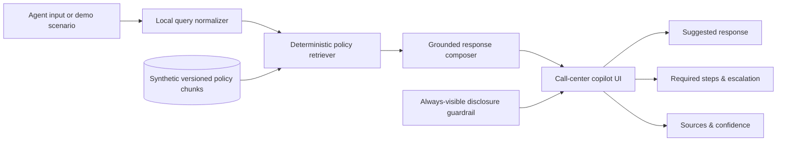

# Clearline Finance Call Assist — Product Requirements Document

> **Status:** Draft for review  
> **Document version:** 0.1  
> **Last updated:** July 31, 2026  
> **Classification:** Portfolio demonstration; all policies, customers, and examples are synthetic.

## 1. Summary

Clearline Finance Call Assist is a policy-aware retrieval-augmented generation (RAG) copilot for fictional finance-service agents. It retrieves approved internal guidance for a customer's stated issue and produces concise, safe call language alongside required verification, escalation, and disclosure safeguards.

Portfolio pitch:

> “I built a policy-aware RAG copilot for finance-service agents that retrieves approved guidance, produces concise call language, and ensures verification and escalation steps are not missed.”

## 2. Goals

- Demonstrate grounded retrieval from a small, transparent set of synthetic policies.
- Surface a read-aloud suggested response, mandatory steps, escalation warning, and traceable policy citations.
- Make the verification guardrail prominent: **Do not disclose account details until verified.**
- Provide three one-click demo scenarios:
  - “I can’t make my payment.”
  - “This payment wasn’t authorized.”
  - “I want a supervisor.”
- Deploy as a static site through GitHub Pages.

## 3. Non-goals

- Connecting to real customer data, payment systems, telephony, or a live LLM service.
- Giving legal, financial, or compliance advice.
- Representing real Clearline Finance policies or operating guidance.
- Persisting inputs, transcripts, or customer information.

## 4. Audience and core journey

The primary user is a fictional call-center agent. They enter or select the customer’s issue; the copilot identifies relevant policy chunks and returns approved handling guidance before the agent speaks.

Example input: `Customer says they can’t make this month’s payment.`

Expected result:

- Suggested response to read
- Required call steps
- Escalation warning
- Citations to the synthetic internal policies used

## 5. Policy corpus

Each policy will include a title, version/date, “may say,” “may not say,” required verification/escalation steps, and approved-language examples. All will display a synthetic-content label.

| ID | Synthetic policy | Retrieval themes |
| --- | --- | --- |
| PAY-EXT | Payment Extension & Due-Date Support | cannot pay, extension, due date, short-term relief |
| FIN-HRD | Financial Hardship Assistance | hardship, income loss, expenses, longer-term difficulty |
| FRAUD-UP | Unauthorized Payment & Fraud Intake | unauthorized charge, payment not mine, fraud/dispute |
| PAYOFF | Payoff Quote Requests | payoff balance, quote, payment in full |
| SUP-CMP | Supervisor Requests & Complaints | supervisor, complaint, dissatisfaction |
| ID-DISC | Identity Verification & Disclosure Controls | verification, account details, disclosures |

## 6. Product requirements

### 6.1 Retrieval and response composition

- Use local, deterministic retrieval over versioned policy chunks; no external data is sent from the deployed demo.
- Rank relevant chunks for a query and show the top supporting sources.
- Compose each scenario result from approved policy fields rather than inventing account-specific facts.
- Cite the policy ID, title, version, and chunk/section for every displayed recommendation.
- Display a plain-language confidence indicator based on retrieval score (High, Medium, or Review needed); it must not imply certainty about a real account.

### 6.2 Safety behavior

- Show the disclosure guardrail continuously at the bottom of the interface.
- Put identity-verification steps before any account-specific discussion.
- Never claim eligibility, approve an extension, promise a fee waiver, determine fraud, quote a payoff amount, or guarantee a supervisor callback.
- Identify required escalation when a policy says the agent cannot resolve the request.

### 6.3 Call-center copilot layout

| Region | Content |
| --- | --- |
| Left | Customer issue / agent question field and the three demo scenarios |
| Center | “Suggested response” read-aloud card |
| Right | Sources, confidence, and required actions |
| Bottom | Persistent “Do not disclose account details until verified” guardrail |

### 6.4 Scenario acceptance criteria

| Scenario | Must retrieve | Must emphasize |
| --- | --- | --- |
| I can’t make my payment. | PAY-EXT, FIN-HRD, ID-DISC | verification, eligibility review, hardship escalation if applicable |
| This payment wasn’t authorized. | FRAUD-UP, ID-DISC | verification, urgent fraud/dispute routing, no liability outcome promises |
| I want a supervisor. | SUP-CMP, ID-DISC | acknowledgement, documented request, approved escalation path |

## 7. Architecture

The initial portfolio implementation will be a static React application. Synthetic policy data and retrieval logic will be bundled with the site, so GitHub Pages can host it without a backend. This deliberately demonstrates RAG *patterns* (chunking, retrieval, citations, grounded composition) without processing real customer data.

## 8. Technical plan

- React + TypeScript + Vite for the static interface.
- Local JSON/TypeScript policy corpus, chunked by policy section.
- Lightweight deterministic lexical scoring for reproducible demos.
- Vitest for retrieval and response-composition unit tests; Testing Library for UI behavior.
- GitHub Actions builds the static site and deploys `dist/` to GitHub Pages on pushes to `main`.
- Vite base path will be configured for the GitHub repository name; the workflow will be the source of truth for deployment.

## 9. Deployment and quality gates

Before the first production-style deploy:

1. `make install`
2. `make test`
3. `make build`
4. Enable GitHub Pages with the repository’s **GitHub Actions** source.
5. Push `main`; the Pages workflow publishes the generated static artifact.

The workflow and application scaffold will be added only after this PRD is approved, per the requested review gate.

## 10. Deliverables after approval

- Six synthetic internal-policy documents and chunked data representation.
- Responsive three-column copilot UI with persistent guardrail.
- All three scripted demos and a custom-query experience.
- Unit/UI tests and deployment workflow.
- README with local setup, test, build, and GitHub Pages instructions.

## 11. Review decisions requested

- Confirm the static, local-only RAG demonstration is the right portfolio scope.
- Confirm the six-policy corpus and three scenario behaviors.
- Approve the proposed React/Vite stack and GitHub Pages deployment approach.

